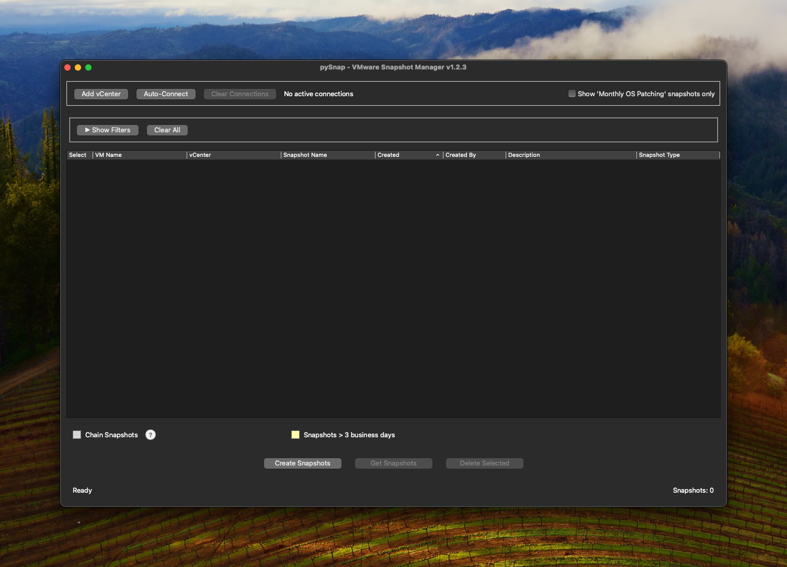

# pySnap - VMware Snapshot Manager

A professional Python-based GUI application for managing VMware snapshots across multiple vCenter servers. pySnap is specifically designed to help system administrators efficiently manage patching snapshots with enterprise-grade features and security.

  

## ✨ Key Features

### Core Functionality
- **Multi-vCenter Management**: Connect to multiple vCenter servers simultaneously
- **Bulk Operations**: Create and delete snapshots across multiple VMs in batch
- **Smart Chain Detection**: Automatically identifies and protects snapshot chains
- **Real-time Progress Tracking**: Visual progress bars with detailed status updates
- **Auto-reconnection**: Monitors connections and automatically reconnects when needed

### Advanced Filtering System
- **Comprehensive Search**: Filter by VM name, snapshot name/description, vCenter, creator, and date range
- **Dynamic Age Highlighting**: Configurable age threshold with business day calculations
- **Smart Dropdowns**: Auto-populated filters with actual data from loaded snapshots
- **Collapsible Interface**: Toggle filter panel to maximize viewing space
- **Real-time Updates**: Instant filtering as you type

### Enterprise Security
- **Secure Credential Storage**: Passwords stored in system keychain (macOS Keychain, Windows Credential Manager, Linux Secret Service)
- **SSL Configuration**: Proper SSL handling for enterprise environments
- **No Plaintext Storage**: No passwords or sensitive data stored in configuration files

### Professional UI/UX
- **Visual Indicators**: Color-coded snapshots (gray for chains, yellow for aged snapshots)
- **Context Menus**: Right-click functionality for data operations
- **Copy Functionality**: Double-click cells or use context menu to copy data
- **Window Management**: Automatic position saving/restoration for all dialogs
- **Status Updates**: Real-time status messages with automatic cleanup

## 🛠️ Requirements

### Runtime Dependencies
- **Python 3.6+**
- **PyQt6** - Modern GUI framework
- **pyVmomi** - VMware SDK for Python
- **keyring** - Secure credential storage
- **urllib3** - HTTP library

1. **Connect to vCenter**
   - Click "Add vCenter"
   - Enter hostname, username, and password
   - Optionally save credentials for auto-connect

2. **Fetch Snapshots**
   - Click "Fetch Snapshots" to load data from all connected vCenters
   - Use filters to find specific snapshots

### Creating Snapshots

1. Click "Create Snapshots"
2. Enter server names (one per line)
3. Provide a descriptive snapshot name
4. Choose whether to include memory
5. Monitor progress in real-time

### Managing Snapshots

- **View All Snapshots**: See snapshots across all connected vCenters
- **Filter Results**: Use the comprehensive filter panel
- **Select for Deletion**: Check boxes next to snapshots to delete
- **Bulk Delete**: Click "Delete Selected" to remove chosen snapshots
- **Copy Data**: Double-click cells or right-click to copy information

### Understanding Visual Indicators

- **Gray Background**: Chain snapshots (cannot be deleted safely)
- **Yellow Background**: Snapshots older than configured threshold (default: 3 business days)
- **Progress Bars**: Real-time operation progress with percentage and details

## 🔧 Configuration

### Auto-Connect Settings
- Configure which vCenters to connect to automatically
- Saved credentials are encrypted in system keychain
- Automatic reconnection every 5 minutes

### Filter Settings
- Configurable age threshold for snapshot highlighting
- Choice between business days vs calendar days
- Customizable age warnings

## 🔒 Security Features

- **Keychain Integration**: Native secure storage on all platforms
- **SSL Certificate Handling**: Configurable for enterprise environments
- **Connection Monitoring**: Automatic health checks and recovery
- **No Credential Logging**: Sensitive data never written to logs

## 📋 System Requirements

### Supported Platforms
- **macOS**: 10.14+ (Universal Binary: Intel + Apple Silicon)
- **Windows**: 10/11
- **Linux**: Most distributions with GUI support

### VMware Compatibility
- **vCenter Server**: 6.5+
- **ESXi**: 6.5+
- **vSphere**: 6.5+

### Logging
- **Log Location**: `~/.vmware_snapshot_manager.log`
- **Rotation**: Automatic (1MB max, 5 backups)
- **Levels**: INFO, WARNING, ERROR, CRITICAL

### Configuration
- **Server List**: `~/.vmware_snapshot_viewer.json`
- **Credentials**: System keychain (secure)
- **Window Positions**: Automatic saving/restoration

## 👨‍💻 Author

**Christian Salas**

## 🐛 Support

For issues, feature requests, or bug reports:
1. Check existing issues in the GitHub repository
2. Create a new issue with detailed information
3. Include log files and system information

## 📄 License

This project is licensed under the MIT License - see the LICENSE file for details.

## ⚠️ Disclaimer

*pySnap is not affiliated with or endorsed by VMware, Inc. VMware and vSphere are registered trademarks of VMware, Inc.*

---